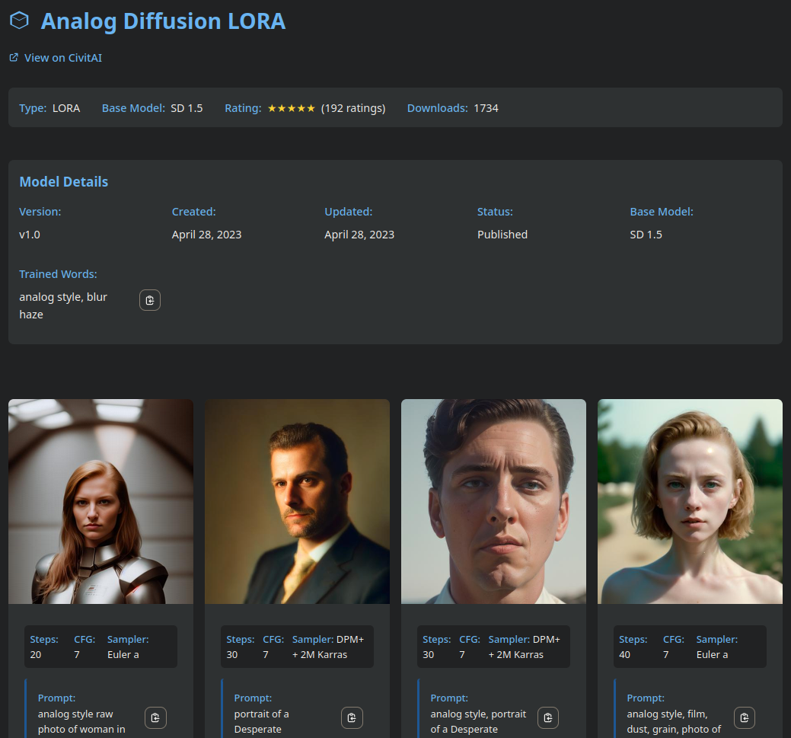

# HTML Generator

Generate detailed HTML pages for your models with image galleries, file details, and download options. The HTML generator creates rich, interactive documentation for your model collection.

## Table of Contents
- [Configuration](#configuration)
- [Features](#features)
- [Example Output](#example-output)
- [Output Structure](#output-structure)
- [Template Variables](#template-variables)
- [Styling](#styling)

---

## Configuration

HTML generation is configured in your YAML configuration file:

```yaml
output:
  metadata:
    html:
      enabled: true
      filename: "{model_name}.html"
```

Enable HTML generation in jobs:

```yaml
jobs:
  generate-html:
    description: "Generate HTML for all models"
    actions:
      - type: scan-paths
        paths: ["lora", "checkpoints"]
        recursive: true
        skip_existing: false  # Process all files
```

## Features

**Core Features:**
- **Responsive Design**:
  - Works on all devices
  - Adapts to screen sizes
  - Mobile-friendly layout

- **Model Information**:
  - Name, type, creator
  - Detailed statistics
  - Version information
  - Base model details

- **Image Gallery**:
  - Preview images with fullscreen support
  - Keyboard navigation (Esc, Arrow keys)
  - Navigation buttons
  - Touch-friendly controls

- **File Details**:
  - Complete model file listings
  - File size and hash information
  - Associated metadata files

- **Download Section**:
  - Easy access to downloads
  - Direct download links
  - File type indicators

- **Copy-to-Clipboard**:
  - One-click copying
  - Visual feedback
  - Success confirmation

## Example Output

The generated HTML pages provide a clean, responsive interface for browsing your model collection:



---

## Output Structure

```
model_pages/
  ├── my_model.html          # Model detail page
  └── another_model.html     # Another model's page
```

**Directory Structure:**
```
model_pages/
  ├── my_model.html          # Model detail page
  └── another_model.html     # Another model's page
```

**Page Contents:**
- Model name and version
- Link to CivitAI model URL
- Creator information
- Base model details
- Rating and statistics
- Description and tags
- Preview image gallery
- Download options

## Template Variables

The HTML generator supports the following variables in paths and filenames to create flexible, organized output:
- `{model_name}`: Model name (sanitized for filenames)
- `{model_dir}`: Directory containing the model file
- `{model_type}`: Model type (LORA, Checkpoint, etc.)
- `{base_model}`: Base model name
- `{version}`: Model version

Example:
```yaml
output:
  metadata:
    html:
      filename: "{model_type}/{model_name}_v{version}.html"
```

## Styling

The HTML output uses a modular CSS structure for maintainable and consistent styling:

**Style Modules:**
- **base.css**:
  - Core styling and layout
  - Typography
  - Color schemes
  - Responsive grid

- **components.css**:
  - Component-specific styles
  - Buttons and controls
  - Cards and containers
  - Navigation elements

- **image-viewer.css**:
  - Image gallery layout
  - Fullscreen viewer
  - Navigation controls
  - Transition effects
