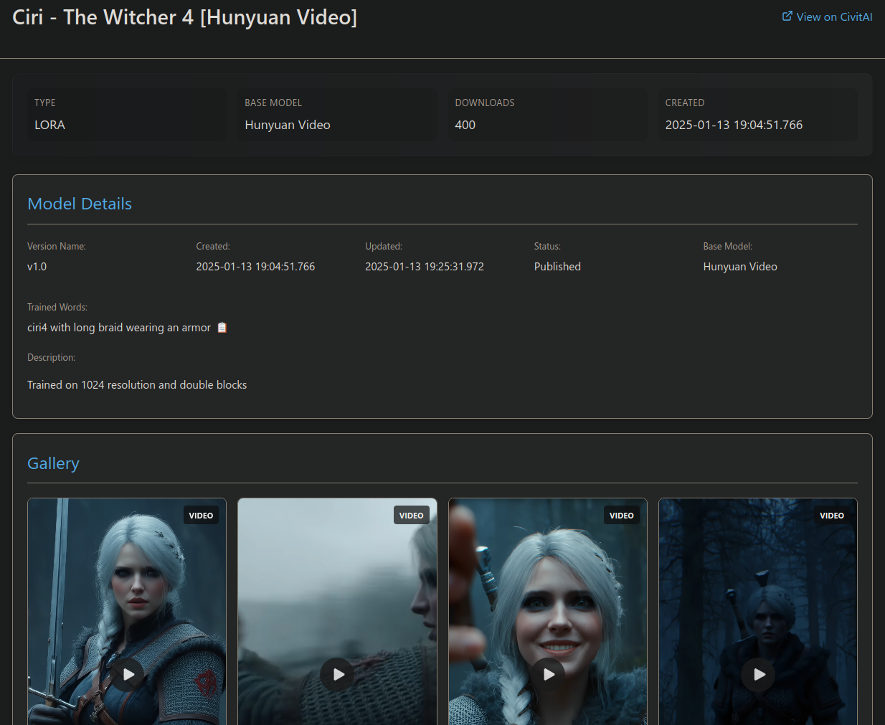

# CivitScraper - make it local again.

CivitScraper is your AI model collection's digital curator, transforming raw files into a structured, searchable archive with rich metadata and visual previews. It seamlessly connects to CivitAI to fetch critical information while keeping your creative assets organized locally—empowering you to manage your growing model library with professional precision.

## Table of Contents
- [Overview](#overview)
- [Installation](#installation)
- [Configuration](#configuration)
  - [Global Settings](#global-settings)
  - [API Configuration](#api-configuration)
  - [Input Paths](#input-paths)
  - [Jobs](#jobs)
  - [Organization Settings](#organization-settings)
  - [Scanner Settings](#scanner-settings)
  - [Logging Configuration](#logging-configuration)
- [Command-Line Usage](#command-line-usage)
  - [Basic Usage](#basic-usage)
  - [Command-Line Arguments](#command-line-arguments)
  - [Examples](#examples)
- [Core Features](#core-features)
  - [Scanning and Processing Model Files](#scanning-and-processing-model-files)
  - [Metadata Retrieval](#metadata-retrieval)
  - [Image Downloading](#image-downloading)
  - [HTML Preview Generation](#html-preview-generation)
  - [File Organization](#file-organization)
- [Job System](#job-system)
  - [Understanding Jobs](#understanding-jobs)
  - [Creating Custom Jobs](#creating-custom-jobs)
- [Advanced Usage](#advanced-usage)
  - [Batch Processing](#batch-processing)
  - [Custom Organization Templates](#custom-organization-templates)
  - [API Rate Limiting and Circuit Breaker](#api-rate-limiting-and-circuit-breaker)
  - [Caching](#caching)
- [Troubleshooting](#troubleshooting)
  - [Common Issues](#common-issues)
  - [Logging](#logging)

## Overview

### Key Features

- **Metadata Retrieval**: Automatically fetch detailed metadata for your model files from the CivitAI API
- **File Organization**: Organize your model files based on metadata (type, creator, base model, etc.)
- **HTML Preview Generation**: Create HTML preview pages for your models with images and metadata
- **Image Downloading**: Download preview images for your models
- **Batch Processing**: Process large collections of models efficiently with configurable concurrency
- **Flexible Configuration**: Customize behavior through a comprehensive configuration system
- **Job System**: Define and run specific tasks through a flexible job system

### How It Works

CivitScraper works by:

1. Scanning directories for model files (LORA, checkpoints, embeddings, etc.)
2. Computing file hashes to identify models
3. Querying the CivitAI API to retrieve metadata
4. Saving metadata as JSON files
5. Downloading preview images (optional)
6. Generating HTML preview pages (optional)
7. Organizing files based on metadata (optional)

## Installation

### Requirements

- Python 3.8 or higher
- Internet connection for API access

### Installation Steps
#### Using Virtual Environment (venv)

For isolated dependencies and cleaner package management, you can install CivitScraper in a Python virtual environment:

```bash
# Install CivitScraper in the virtual environment
git clone https://github.com/moonwhaler/civitscraper.git
cd civitscraper

# Create a virtual environment
python -m venv venv

# Activate the virtual environment

# On Windows:
venv\Scripts\activate
# On macOS/Linux:
source venv/bin/activate

pip install -e .

# Now you can use CivitScraper
civitscraper --help

# When finished, deactivate the virtual environment
deactivate
```

This approach keeps CivitScraper's dependencies isolated from your system Python installation.

## Configuration

CivitScraper uses a YAML configuration file to control its behavior. The default configuration file is located at `config/default.yaml`.

### Global Settings

The configuration includes global settings for various aspects of the application:

```yaml
# Scanner settings
scanner:
  cache_dir: ".civitscraper_cache"  # Where to store cache files
  cache_validity: 86400            # [seconds] Cache lifetime (24 hours)
  force_refresh: false             # Ignore cache and force refresh

# Logging settings
logging:
  level: DEBUG                     # Main log level
  console:
    enabled: true                  # Log to console
    level: INFO                    # Console log level
```

### API Configuration

The `api` section configures the connection to the CivitAI API:

```yaml
api:
  key: "your_api_key"                # Your CivitAI API key
  base_url: "https://civitai.com/api/v1"  # API endpoint
  timeout: 30             # [seconds] API request timeout
  max_retries: 3         # Number of times to retry failed requests
  user_agent: "CivitScraper/0.2.0"  # User agent string

  # Batch processing settings
  batch:
    enabled: true         # Enable batch processing
    max_concurrent: 4     # Maximum parallel requests
    rate_limit: 100      # Requests/minute
    retry_delay: 1000    # Base delay (ms) for exponential backoff
    cache_size: 100      # LRU cache size

    # Circuit breaker prevents API abuse during outages
    circuit_breaker:
      failure_threshold: 5    # Number of failures before blocking requests
      reset_timeout: 60       # Seconds to wait before auto-recovery
```

### Input Paths

The `input_paths` section defines where to look for different types of model files:

```yaml
input_paths:
  # LORA models directory
  lora:
    path: "/path/to/lora/models"     # Directory containing LORA models
    type: LORA                       # Model type identifier
    patterns: ["*.safetensors"]      # File patterns to match

  # Stable Diffusion checkpoints
  checkpoints:
    path: "/path/to/checkpoints"     # Directory containing checkpoints
    type: Checkpoint                 # Model type identifier
    patterns: ["*.safetensors"]      # File patterns to match

  # Textual Inversion embeddings
  embeddings:
    path: "/path/to/embeddings"      # Directory containing embeddings
    type: TextualInversion           # Model type identifier
    patterns: ["*.pt", "*.safetensors"]  # File patterns to match
```

### Jobs

The `jobs` section defines specific tasks to run. Each job is self-contained with all necessary settings:

```yaml
# Default job to run when no job is specified
default_job: "fetch-all"

jobs:
  # Process all model types with full settings
  fetch-all:
    type: scan-paths
    recursive: true      # Search in subdirectories
    skip_existing: true  # Skip files that already have metadata
    verify_hashes: true  # Verify file hashes against CivitAI data
    paths: ["lora"]      # Process these path types
    output:
      metadata:
        format: "json"
        path: "{model_dir}"     # Where to save metadata
        filename: "{model_name}.json"  # Metadata filename
        html:
          enabled: true         # Generate HTML preview pages
          filename: "{model_name}.html"  # HTML filename
      images:
        save: true             # Download preview images
        path: "{model_dir}"    # Where to save images
        max_count: 4           # Maximum number of images to download
        filenames:
          preview: "{model_name}.preview{ext}"  # Preview image filename pattern
    organization:
      enabled: false            # Enable model organization
      dry_run: false            # Simulate file operations without making changes
      template: "by_type_and_basemodel"  # Organization template to use
      custom_template: ""       # Custom organization path template
      output_dir: "{model_dir}/organized"  # Where to put organized files
      operation_mode: "move"    # [copy/move/symlink] How to organize files

  # Metadata-only job (no images)
  metadata-only:
    type: scan-paths
    recursive: true
    skip_existing: true
    verify_hashes: true
    paths: ["lora"]
    output:
      metadata:
        format: "json"
        path: "{model_dir}"
        filename: "{model_name}.json"
        html:
          enabled: true
          filename: "{model_name}.html"
      images:
        save: false             # Don't download images

  # Synchronize LoRA trigger words
  sync-triggers:
    type: sync-lora-triggers
    description: "Synchronize LoRA trigger words"
    recursive: true
    loras_file: "loras.json"
    paths: ["lora"]
```

### Organization Settings

The organization settings control how files are organized based on metadata:

```yaml
organization:
  enabled: false            # Enable model organization
  dry_run: false            # Simulate file operations without making changes
  template: "by_type_and_basemodel"  # Organization template to use
  custom_template: ""       # Custom organization path template
  output_dir: "{model_dir}/organized"  # Where to put organized files
  operation_mode: "move"    # [copy/move/symlink] How to organize files
```

Available organization templates:
- `by_type`: Organize by model type
- `by_creator`: Organize by creator
- `by_type_and_creator`: Organize by type and creator
- `by_type_and_basemodel`: Organize by type and base model
- `by_base_model`: Organize by base model and type
- `by_nsfw`: Organize by NSFW status and type
- `by_type_basemodel_nsfw`: Organize by type, base model, and NSFW status
- `by_date`: Organize by year, month, and type
- `by_model_info`: Organize by model type and name

### Scanner Settings

The scanner settings control how the scanner operates and caches data:

```yaml
scanner:
  cache_dir: ".civitscraper_cache"  # Where to store cache files
  cache_validity: 86400            # [seconds] Cache lifetime (24 hours)
  force_refresh: false             # Ignore cache and force refresh
```

### Logging Configuration

The logging settings control how the application logs information:

```yaml
logging:
  level: DEBUG                     # Main log level

  # Console output settings
  console:
    enabled: true                  # Log to console
    level: INFO                    # Console log level
    simple: false                  # Use detailed format for debugging

  # File logging settings
  file:
    enabled: true                  # Log to file
    level: DEBUG                   # File log level
    directory: logs                # Log file directory
    max_size: 10                   # [MB] Max log file size
    backup_count: 5                # Number of backup files to keep
```

## Command-Line Usage

### Basic Usage

```bash
# Run the default job
civitscraper

# Run a specific job
civitscraper -j fetch-all

# Run with a custom configuration file
civitscraper -c my_config.yaml
```

### Command-Line Arguments

- `-c, --config`: Path to configuration file
- `-j, --job`: Execute a specific job
- `--all-jobs`: Execute all jobs
- `--dry-run`: Simulate file operations without making changes
- `--force-refresh`: Ignore cache and force refresh metadata
- `--debug`: Enable debug logging
- `--quiet`: Suppress console output

### Examples

```bash
# Run the default job with debug logging
civitscraper --debug

# Run a specific job with a custom configuration file
civitscraper -c my_config.yaml -j fetch-loras

# Run all jobs in dry-run mode
civitscraper --all-jobs --dry-run

# Force refresh metadata
civitscraper --force-refresh
```

## Core Features

### Scanning and Processing Model Files

CivitScraper scans directories for model files based on the configured input paths. It uses file patterns to identify model files and can search recursively in subdirectories.

The scanner can be configured to:
- Skip files that already have metadata
- Verify file hashes against CivitAI data
- Force refresh metadata

```yaml
# In a job configuration:
recursive: true      # Search in subdirectories
skip_existing: true  # Skip files that already have metadata
verify_hashes: true  # Verify file hashes against CivitAI data
```

### Metadata Retrieval

CivitScraper retrieves metadata from the CivitAI API based on file hashes. The metadata includes:
- Model name and description
- Creator information
- Tags
- Model type
- Base model
- NSFW status
- Creation date
- Statistics (downloads, favorites, ratings)
- Trained words (for LORA models)
- Preview images

The metadata is saved as JSON files in the configured location:

```yaml
# In a job configuration:
output:
  metadata:
    format: "json"
    path: "{model_dir}"     # Where to save metadata
    filename: "{model_name}.json"  # Metadata filename
```

### Image Downloading

CivitScraper can download preview images for models from the CivitAI API. The images are saved in the configured location:

```yaml
# In a job configuration:
output:
  images:
    save: true             # Download preview images
    path: "{model_dir}"    # Where to save images
    max_count: 4           # Maximum number of images to download
    filenames:
      preview: "{model_name}.preview{ext}"  # Preview image filename pattern
```

### HTML Preview Generation

CivitScraper can generate HTML preview pages for models. The HTML pages include:
- Model name and description
- Creator information
- Tags
- Model type
- Base model
- NSFW status
- Creation date
- Statistics (downloads, favorites, ratings)
- Trained words (for LORA models)
- Preview images
- Generation parameters (if available)



The HTML pages are saved in the configured location:

```yaml
# In a job configuration:
output:
  metadata:
    html:
      enabled: true         # Generate HTML preview pages
      filename: "{model_name}.html"  # HTML filename
      generate_gallery: true         # Generate a gallery of all models
      gallery_path: "gallery.html"   # Path to gallery HTML file
      gallery_title: "Model Gallery" # Gallery title
      include_existing_in_gallery: true # Include existing model cards in gallery
```

#### Gallery Generation

CivitScraper can generate a comprehensive gallery view that showcases all your models in a single HTML page. This feature:

- Creates a unified view of all your model cards
- Intelligently prioritizes organized model versions
- Can include both newly processed and existing model cards
- Supports custom titles and output paths
- Provides easy navigation between models

The gallery is automatically generated during the model processing phase when enabled in the configuration:

```yaml
output:
  metadata:
    html:
      generate_gallery: true                       # Enable gallery generation
      gallery_path: "/path/to/model_gallery.html"  # Output path for gallery
      gallery_title: "My AI Model Collection"      # Custom gallery title
      include_existing_in_gallery: true            # Include existing model cards
```

The gallery provides a convenient overview of your entire model collection, making it easier to browse and find models without having to navigate through directories.

### File Organization

CivitScraper can organize model files based on metadata. The organization is controlled by the organization settings:

> **⚠️ WARNING**: The file organization feature will change file locations (in "move" mode) or create new files (in "copy" or "symlink" mode). The author takes no responsibility for any unexpected outcomes when using this feature. Always back up your files before using the organization functionality - and test it before production run!

```yaml
# In a job configuration:
organization:
  enabled: true             # Enable model organization
  dry_run: false            # Simulate file operations without making changes
  template: "by_type_and_basemodel"  # Organization template to use
  custom_template: ""       # Custom organization path template
  output_dir: "{model_dir}/organized"  # Where to put organized files
  operation_mode: "symlink"    # [copy/move/symlink] How to organize files
```

The organization can be performed using different operation modes:
- `copy`: Copy files to the organized location
- `move`: Move files to the organized location (warning: changes your original file locations)
- `symlink`: Create symbolic links in the organized location (safest option, preserves originals)

The `symlink` mode is especially useful as it allows you to maintain the original file structure while creating an organized view, without duplicating files or risking file moves.

## Processing Flow

CivitScraper processes model files in multiple phases, ensuring efficient and organized handling:

### Phase 1: Metadata Fetching
- Scans directories for model files based on configured patterns
- Computes file hashes for model identification
- Fetches metadata from CivitAI API for all files in a batch
- Builds a complete metadata dictionary before proceeding

### Phase 2: File Organization (if enabled)
- Uses the metadata to organize files according to the configured template
- Creates the organization structure (directories) as needed
- Performs the file operation (copy/move/symlink) based on configured mode
- Maintains a mapping between original files and their organized versions

### Phase 3: Processing Organized Files
- Processes the organized files (or original files if organization disabled)
- Generates JSON metadata files
- Creates HTML model card pages
- Downloads preview images

### Phase 4: Gallery Generation (if enabled)
- Scans for model card HTML files
- Prioritizes organized versions when duplicates exist
- Optionally includes pre-existing model cards
- Generates a unified gallery of all models

This phased approach ensures that all files are processed consistently and maintains proper relationships between original and organized files.

## Job System

### Understanding Jobs

Jobs are specific tasks that CivitScraper can execute. Each job has a type and contains all the settings needed for that specific task.

The main job types are:
- `scan-paths`: Scan directories for model files and process them
- `sync-lora-triggers`: Synchronize LORA trigger words with a Krita AI Diffusion (loras.json) file

Each job is self-contained with all necessary settings. Here are examples of different job types:

#### Scan-Paths Job

```yaml
fetch-all:
  type: scan-paths
  recursive: false     # Search in top level directory only
  skip_existing: true  # Skip files that already have metadata
  verify_hashes: true  # Verify file hashes against CivitAI data
  paths: ["lora"]      # Process these path types
  output:
    metadata:
      format: "json"
      path: "{model_dir}"
      filename: "{model_name}.json"
      html:
        enabled: true
        filename: "{model_name}.html"
        generate_gallery: true
        gallery_path: "gallery.html"
        gallery_title: "Model Gallery"
    images:
      save: true
      path: "{model_dir}"
      max_count: 2     # Maximum number of images to download
      filenames:
        preview: "{model_name}.preview{ext}"
  organization:
    enabled: true             # Enable model organization
    dry_run: false            # Simulate file operations without making changes
    template: "by_type_and_basemodel"  # Organization template to use
    output_dir: "{model_dir}/organized"  # Where to put organized files
    operation_mode: "symlink"    # [copy/move/symlink] How to organize files
```

## Krita AI Diffusion Integration

CivitScraper includes specialized functionality for integration with Krita AI Diffusion, a popular AI painting tool.

### Synchronizing LoRA Trigger Words

The `sync-lora-triggers` job type allows you to synchronize LoRA trigger words (activation text) with Krita AI Diffusion's `loras.json` file:

```yaml
sync-triggers:
  type: sync-lora-triggers
  description: "Synchronize LoRA trigger words"
  recursive: true
  skip_existing: true
  verify_hashes: true
  loras_file: "loras.json"
  paths: ["lora"]
```

This functionality:
- Scans your LoRA model files and their associated metadata
- Extracts the recommended activation text (trigger words) from CivitAI metadata
- Updates the Krita AI Diffusion `loras.json` file with these trigger words
- Enables one-click activation of LoRAs in Krita with the correct parameters

The integration ensures that your LoRA models work correctly in Krita AI Diffusion without manual configuration of trigger words.

### Creating Custom Jobs

You can create custom jobs by defining them in the `jobs` section of the configuration file. Each job should be self-contained with all necessary settings:

```yaml
jobs:
  my_custom_job:
    type: scan-paths
    recursive: true
    skip_existing: true
    verify_hashes: true
    paths: ["lora", "checkpoints"]  # Process specific paths
    output:
      metadata:
        format: "json"
        path: "{model_dir}"
        filename: "{model_name}.json"
        html:
          enabled: true
          filename: "{model_name}.html"
          generate_gallery: true
          gallery_path: "custom_gallery.html"
      images:
        save: true
        path: "{model_dir}"
        max_count: 2               # Limit to 2 images
```

You can create multiple jobs with different configurations to handle different tasks:

```yaml
jobs:
  # Process LORA models
  process-loras:
    type: scan-paths
    recursive: true
    skip_existing: true
    verify_hashes: true
    paths: ["lora"]
    # ... other settings ...

  # Process checkpoints
  process-checkpoints:
    type: scan-paths
    recursive: true
    skip_existing: true
    verify_hashes: true
    paths: ["checkpoints"]
    # ... other settings ...

  # Metadata only (no images)
  metadata-only:
    type: scan-paths
    recursive: true
    skip_existing: true
    verify_hashes: true
    paths: ["lora"]
    output:
      metadata:
        format: "json"
        path: "{model_dir}"
        filename: "{model_name}.json"
        html:
          enabled: true
          filename: "{model_name}.html"
      images:
        save: false             # Don't download images
```

## Advanced Usage

### Batch Processing

CivitScraper supports batch processing for efficient handling of large collections. The batch processing settings control concurrency and rate limiting:

```yaml
api:
  batch:
    enabled: true         # Enable batch processing
    max_concurrent: 4     # Maximum parallel requests using thread-safe semaphore
    rate_limit: 100       # Requests/minute (uses token bucket with per-endpoint tracking)
    retry_delay: 1000     # Base delay (ms) for exponential backoff when rate limited
    cache_size: 100       # LRU cache size - evicts least recently used entries when full
    
    # Advanced batch settings
    # Circuit breaker prevents API abuse during outages by tracking failures per endpoint
    circuit_breaker:
      failure_threshold: 5    # Number of failures before blocking requests to an endpoint
      reset_timeout: 60       # Seconds to wait before auto-recovery after blocking
```

### File Discovery and Path Management

CivitScraper provides sophisticated file discovery and path management capabilities:

```yaml
# In a job configuration:
recursive: true      # Enable recursive directory scanning
skip_existing: true  # Skip files that already have metadata
verify_hashes: true  # Verify file hashes against CivitAI data
```

The file discovery system:
- Recursively scans directories for model files based on patterns
- Identifies model types automatically based on directory configuration
- Skips files that already have metadata if configured
- Prioritizes organized model versions over original versions

The path management system handles file paths using templates with placeholders:

```yaml
output:
  metadata:
    path: "{model_dir}"
    filename: "{model_name}.json"
  images:
    path: "{model_dir}"
    filenames:
      preview: "{model_name}.preview{ext}"
```

### Custom Organization Templates

You can create custom organization templates using the `custom_template` setting:

```yaml
organization:
  custom_template: "{type}/{creator}/{base_model}"
```

Available placeholders:
- `{model_name}`: Model name
- `{model_type}`: Model type
- `{type}`: Model type (alias for model_type)
- `{creator}`: Creator username
- `{base_model}`: Base model
- `{nsfw}`: NSFW status (nsfw/sfw)
- `{year}`: Creation year
- `{month}`: Creation month

The organization system intelligently creates the directory structure and formats file paths using these placeholders, ensuring a consistent and logical organization scheme.

### API Rate Limiting and Circuit Breaker

CivitScraper includes rate limiting and circuit breaker protection to prevent API abuse:

```yaml
api:
  batch:
    rate_limit: 100       # Requests/minute
    circuit_breaker:
      failure_threshold: 5    # Number of failures before blocking requests
      reset_timeout: 60       # Seconds to wait before auto-recovery
```

### Caching

CivitScraper caches API responses to reduce API usage and improve performance:

```yaml
scanner:
  cache_dir: ".civitscraper_cache"  # Where to store cache files
  cache_validity: 86400            # [seconds] Cache lifetime (24 hours)
  force_refresh: false             # Ignore cache and force refresh
```

## Troubleshooting

### Common Issues

#### API Key Issues

If you encounter API key issues, make sure your API key is correctly set in the configuration file or as an environment variable:

```yaml
api:
  key: "your_api_key"
```

Or set the environment variable:

```bash
export CIVITAI_API_KEY="your_api_key"
```

#### Rate Limiting

If you encounter rate limiting issues, try reducing the `rate_limit` setting:

```yaml
api:
  batch:
    rate_limit: 50        # Reduce from 100 to 50
```

#### File Organization Issues

If file organization is not working as expected, check the organization settings:

```yaml
organization:
  enabled: true           # Make sure this is true
  template: "by_type_and_basemodel"
  output_dir: "{model_dir}/organized"
  operation_mode: "copy"  # Try "copy" instead of "move" for testing
```

### Logging

CivitScraper provides detailed logging to help diagnose issues:

```yaml
logging:
  level: DEBUG            # Set to DEBUG for more detailed logs
  console:
    enabled: true
    level: DEBUG          # Set to DEBUG for more detailed console logs
  file:
    enabled: true
    level: DEBUG
    directory: logs
```

You can also enable debug logging from the command line:

```bash
civitscraper --debug
```

Log files are stored in the configured log directory (default: `logs`).

## Development

### Testing

CivitScraper uses pytest for testing. To run the tests:

```bash
# Install development dependencies
pip install -r requirements-dev.txt

# Run tests
pytest
```

For more detailed test output with coverage information:

```bash
pytest --cov=civitscraper --cov-report=term --cov-report=html
```

This will generate a coverage report in the terminal and an HTML report in the `htmlcov` directory.

### Pre-commit Hooks

CivitScraper uses pre-commit hooks to ensure code quality. To set up pre-commit:

```bash
# Install pre-commit
pip install pre-commit

# Install the git hooks
pre-commit install
```

The pre-commit hooks will run automatically when you commit changes. They include:
- Code formatting with black and isort
- Linting with flake8
- Type checking with mypy
- Running tests with pytest

You can also run the hooks manually:

```bash
pre-commit run --all-files
```

## License

CivitScraper is licensed under the [GNU Affero General Public License v3.0 (AGPL-3.0)](https://www.gnu.org/licenses/agpl-3.0.en.html). This is a strong copyleft license that requires anyone who distributes the code or a derivative work to make the source available under the same terms.

### What this means:
- You can use, copy, modify, and distribute this software.
- If you modify the software and distribute it (including running it on a server that others can interact with), you must make your modifications available under the AGPL-3.0.
- You must include the original copyright notice and license.

### Dependencies

CivitScraper uses the following open-source libraries, each with their own licenses:

- [requests](https://github.com/psf/requests): Apache License 2.0
- [pyyaml](https://github.com/yaml/pyyaml): MIT License
- [jinja2](https://github.com/pallets/jinja): BSD License
- [blake3](https://github.com/oconnor663/blake3-py): Apache License 2.0 or MIT License
- [setuptools](https://github.com/pypa/setuptools): MIT License
- [wheel](https://github.com/pypa/wheel): MIT License

These dependencies all have permissive licenses that are compatible with the AGPL-3.0 license of CivitScraper.

For the full license text, see the [GNU Affero General Public License v3.0](https://www.gnu.org/licenses/agpl-3.0.en.html).
